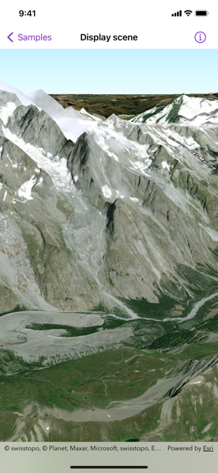

# Display scene

Display a scene with a terrain surface and some imagery.

## Use case

Scene views are 3D representations of real-world areas and objects. Scene views are helpful for visualizing complex datasets where 3D relationships, topography, and elevation of elements are important factors.

## How to use the sample

When loaded, the sample will display a scene. Pan and zoom to explore the scene.

## How it works

1. Create a `Scene` object with `arcGISImageryStandard` basemap style.
2. Create a `Surface` object.
3. Add an `ArcGISTiledElevationSource` object to the surface.
4. Set the surface to the scene's base surface.
5. Create a `SceneView` instance with the scene.

## Relevant API

* ArcGISTiledElevationSource
* Scene
* SceneView
* Surface

## Tags

3D, basemap, elevation, scene, surface
