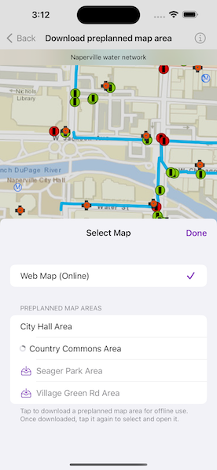

# Download preplanned map area

Take a map offline using a preplanned map area.

## Use case

Generating offline maps on demand for a specific area can be time consuming for users and a processing load on the server. If areas of interest are known ahead of time, a web map author can pre-create packages for these areas. This way, the generation only needs to happen once, making the workflow more efficient for users and servers.

An archeology team could define preplanned map areas for dig sites which can be taken offline for field use. To see the difference, compare this sample to the "Generate offline map" sample.

## How to use the sample

Select a preplanned map area by tapping the "Select Map" button and selecting one of the showing available areas. Tapping a cell initiates a download, and shows download progress in the interim. Once downloaded, the preplanned map is displayed in the map view. If a preplanned map is reselected later, the locally cached data is loaded immediately.

## How it works

1. Create a `Map` instance from a `PortalItem`.
2. Create an `OfflineMapTask` instance from the portal item.
3. Load the offline map task's `PreplannedMapArea`s.
4. To download a selected map area, create the default parameters with the offline map task's `makeDefaultDownloadPreplannedOfflineMapParameters(preplannedMapArea:)` method, specifying the selected map area.
5. Set the parameter's update mode.
6. Create a `DownloadPreplannedOfflineMapJob` instance with the offline map task's `makeDownloadPreplannedOfflineMapJob(parameters:downloadDirectory:)` method, passing in the parameters and a download directory as arguments.
7. Start the job and await its output.
8. Get the offline `Map` from the output when the job successfully finishes.
9. Update the map with the offline map.

## Relevant API

* DownloadPreplannedOfflineMapResult
* OfflineMapTask
* OfflineMapTask.makeDefaultDownloadPreplannedOfflineMapParameters(preplannedMapArea:)
* OfflineMapTask.makeDownloadPreplannedOfflineMapJob(parameters:downloadDirectory:)
* PreplannedMapArea

## About the data

The [Naperville water network](https://www.arcgis.com/home/item.html?id=acc027394bc84c2fb04d1ed317aac674) map is based on ArcGIS Solutions for Stormwater and provides a realistic depiction of a theoretical stormwater network.

## Additional information

`DownloadPreplannedOfflineMapParameters.updateMode` can be used to set the way the preplanned map area receives updates in several ways:

* `noUpdates`: No updates will be performed. This mode is intended for when a static snapshot of the data is required, and it does not create a replica. This is the mode used for this sample.
* `syncWithFeatureServices`: Changes, including local edits, will be synced directly with the underlying feature services. This is the default update mode.
* `downloadScheduledUpdates`: Scheduled, read-only updates will be downloaded from the online map area and applied to the local mobile geodatabases.
* `downloadScheduledUpdatesAndUploadNewFeatures`: An advanced workflow where scheduled, read-only updates will be downloaded from the online map area and applied to the local mobile geodatabases, and new features added on the client side can also be synchronized with the server.

For more information about offline workflows, see [Offline maps, scenes, and data](https://developers.arcgis.com/swift/offline-maps-scenes-and-data/) in the *ArcGIS Developers* guide.

## Tags

map area, offline, pre-planned, preplanned
