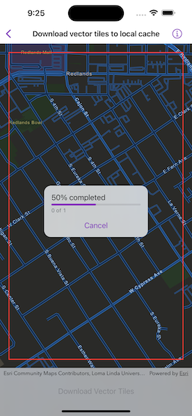

# Download vector tiles to local cache

Download tiles from an online vector tile service.

## Use case

Field workers with limited network connectivity can use exported vector tiles as a basemap for use while offline.

## How to use the sample

When the vector tiled layer loads, zoom in to the extent you want to export. The red box shows the extent that will be exported. Tap the "Export Vector Tiles" button to start the job. An error will show if the extent is larger than the maximum limit allowed. When finished, a dialog will show the exported result in a new map view.

## How it works

1. Create an `ExportVectorTilesTask` instance, passing in the `PortalItem` for the vector tiled layer. Since vector tiled layers are premium content, you must first authenticate with the Portal.
2. Create parameters for the export by using the task's method, `ExportVectorTilesTask.makeDefaultExportVectorTilesParameters(areaOfInterest:maxScale:)`, specifying the area of interest and max scale.
3. Create an `ExportVectorTileJob` instance by using the task's method, `ExportVectorTilesTask.makeExportVectorTilesJob(parameters:vectorTileCacheURL:itemResourceCacheURL:)`, passing in the parameters and specifying a vector tile cache path and an item resource path. The resource path is required if you want to export the tiles with the style.
4. Start the job and await its output.
5. Get the `VectorTileCache` and `ItemResourceCache` from the output and create an `ArcGISVectorTiledLayer` instance.
6. Create a `Map` instance, specifying a basemap with a base layer of the vector tiled layer.
7. Set the map's initial viewpoint to the area of interest and create a map view with the map.

## Relevant API

* ArcGISVectorTiledLayer
* ExportVectorTilesJob
* ExportVectorTilesParameters
* ExportVectorTilesResult
* ExportVectorTilesTask
* ExportVectorTilesTask.makeDefaultExportVectorTilesParameters(areaOfInterest:maxScale:)
* ExportVectorTilesTask.makeExportVectorTilesJob(parameters:vectorTileCacheURL:itemResourceCacheURL:)
* ItemResourceCache
* VectorTileCache

## Additional information

**NOTE:** Downloading tiles for offline use requires authentication with the web map's server. To use this sample, you will need an [ArcGIS Online](https://www.arcgis.com) account.

Vector tiles have high drawing performance and smaller file size compared to regular tiled layers, due to consisting solely of points, lines, and polygons. However, in ArcGIS Maps SDK they cannot be displayed in scenes. Visit [ArcGIS for Developers](https://developers.arcgis.com/ios/layers/#layer-types) to learn more about the characteristics of ArcGIS vector tiled layers.

## Tags

cache, download, offline, vector
