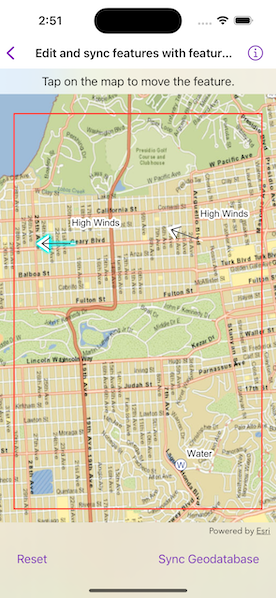

# Edit and sync features with feature service

Synchronize offline edits with a feature service.

## Use case

A survey worker who works in an area without an internet connection could take a geodatabase of survey features offline at their office, make edits and add new features to the offline geodatabase in the field, and sync the updates with the online feature service after returning to the office.

## How to use the sample

Pan and zoom to position the red rectangle around the area you want to take offline. Tap "Generate Geodatabase" to take the area offline. When complete, the map will update to only show the offline area. To edit features, tap on a feature to select it and tap again anywhere else on the map to move the selected feature to the tapped location. To sync the edits with the feature service, tap the "Sync Geodatabase" button.

## How it works

1. Create a `GeodatabaseSyncTask` from a URL to a feature service.
2. Create the default `GenerateGeodatabaseParameters` using `GeodatabaseSyncTask.makeDefaultGenerateGeodatabaseParameters(extent:)`, passing in an `Envelope` extent.
3. Create a `GenerateGeodatabaseJob` using `GeodatabaseSyncTask.makeGenerateGeodatabaseJob(parameters:downloadFileURL:)`, passing in the parameters and a path to where the geodatabase should be downloaded locally.
4. Start the job and get the result `Geodatabase`.
5. To enable editing, load the geodatabase and get its feature tables. Create feature layers from the feature tables and add them to the map's operational layers collection.
6. Create the default `SyncGeodatabaseParameters` using `GeodatabaseSyncTask.makeDefaultSyncGeodatabaseParameters(geodatabase:syncDirection:)`.
7. Create a `SyncGeodatabaseJob` from `GeodatabaseSyncTask` using `makeSyncGeodatabaseJob(parameters:geodatabase:)` passing in the parameters and geodatabase as arguments.
8. Start the sync job to synchronize the edits.

## Relevant API

* FeatureLayer
* FeatureTable
* GenerateGeodatabaseJob
* GenerateGeodatabaseParameters
* GeodatabaseSyncTask
* SyncGeodatabaseJob
* SyncGeodatabaseParameters
* SyncLayerOption

## Offline data

This sample uses a [San Francisco offline basemap tile package](https://www.arcgis.com/home/item.html?id=e4a398afe9a945f3b0f4dca1e4faccb5).

## About the data

The basemap uses an offline tile package of San Francisco. The online feature service has features with wildfire information.

## Tags

feature service, geodatabase, offline, synchronize
