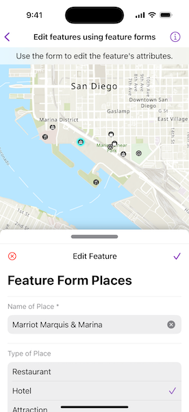

# Edit features using feature forms

Display and edit feature attributes using feature forms.

## Use case

Feature forms help enhance the accuracy, efficiency, and user experience of attribute editing in your application.  Forms can be authored as part of the WebMap using [Field Maps Designer](https://www.arcgis.com/apps/fieldmaps/) or using Map Viewer. This allows for a simplified user experience to edit feature attribute data on the web-map.  

## How to use the sample

Tap a feature on the map to open a bottom sheet displaying the FeatureForm. Select through the list of form elements and perform any edits to update the field values. Tap the submit icon to commit the changes on the web map.

## How it works

1. Add an `ArcGISMap` to the `MapView` using `PortalItem` URL and itemID.
2. When the map is tapped, perform an identify operation to check if the tapped location is an `ArcGISFeature`.
3. Create a `FeatureForm()` object using the identified `ArcGISFeature`. 
  * **Note:** If the feature's `FeatureLayer`, `ArcGISFeatureTable`, or the `SubtypeSublayer` has an authored `FeatureFormDefinition`, then this definition will be used to create the `FeatureForm`. If such a definition is not found, a default definition is generated.
4. On the screen within a bottom sheet, use the `FeatureForm` Toolkit component to display the feature form configuration by providing the created `featureForm` object.
5. Optionally, you can add a `validationErrorVisibility` option to the `FeatureForm` Toolkit component that determines the behavior of when the validation errors are visible.
6. Once edits are added to the form fields, check to verify that there are no validation errors using `featureForm.validationErrors`. The list will be empty if there are no errors.
7. To commit edits on the service geodatabase:
    1. Call `featureForm.finishEditing()` to save edits to the database.
    2. Retrieve the backing service feature table's geodatabase using `(featureForm.feature.featureTable as? ServiceFeatureTable)?.serviceGeodatabase`.
    3. Verify the service geodatabase can commit changes back to the service using `serviceGeodatabase.serviceInfo?.canUseServiceGeodatabaseApplyEdits`
    4. If apply edits are allowed, call `serviceGeodatabase.applyEdits()` to apply local edits to the online service.
    5. If edits are not allowed on the `ServiceGeodatabase`, then apply edits to the `ServiceFeatureTable` using `ServiceFeatureTable.applyEdits()`

## Relevant API

* ArcGISFeature
* FeatureForm
* FeatureLayer
* FieldFormElement
* GroupFormElement
* ServiceFeatureTable

## About the data

This sample uses a feature forms enabled [web-map](https://www.arcgis.com/home/item.html?id=516e4d6aeb4c495c87c41e11274c767f) which contains fictional places in San Diego of various hotels, resturants, shopping centers with relevant reviews and ratings.

## Additional information

Follow the [tutorial](https://doc.arcgis.com/en/arcgis-online/create-maps/create-form-mv.htm) to create your own form using the Map Viewer. This sample uses the FeatureForm and GeoViewCompose Toolkit modules to be able to implement a Composable MapView which displays a Composable FeatureForm UI.

## Tags

compose, edits, feature, feature forms, form, toolkit
