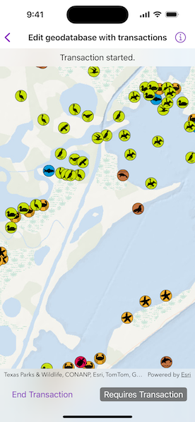

# Edit geodatabase with transactions

Use transactions to manage how changes are committed to a geodatabase.

## Use case

Transactions allow you to control how changes are added to a database. This is useful to ensure that when multiple changes are made to a database, they all succeed or fail at once. For example, you could have a business rule that both parent/guardian and student must be added to a database used for calculating school bus routes. You can use transactions to avoid breaking the business rule if you lose power while between the steps of adding the student and parent/guardian.

## How to use the sample

When the sample loads, a feature service is taken offline as a geodatabase. When the geodatabase is ready, you can add multiple types of features. Tap "Start" to start a transaction. When you stop editing, you can choose to commit the changes or roll them back. To apply edits directly, untoggle "Requires Transaction". You can synchronize the local geodatabase with the feature service by pressing "Sync".

## How it works

1. Take the feature service offline as a geodatabase and display the local tables from the geodatabase in feature layers.
2. Begin the transaction on the geodatabase.
3. Add one or more features to the feature table(s).
4. When ready, either commit the transaction to the geodatabase or roll back the transaction.
5. Use a geodatabase sync task to sync changes to the local geodatabase with the feature service.

## Relevant API

* GenerateGeodatabaseJob
* GenerateGeodatabaseParameters
* Geodatabase
* GeodatabaseSyncTask
* SyncGeodatabaseJob
* SyncGeodatabaseParameters

## About the data

The sample uses a publicly-editable, sync-enabled [feature service](https://sampleserver6.arcgisonline.com/arcgis/rest/services/Sync/SaveTheBaySync/FeatureServer) demonstrating a schema for recording wildlife sightings.

## Tags

commit, database, geodatabase, geometry editor, transact, transactions
