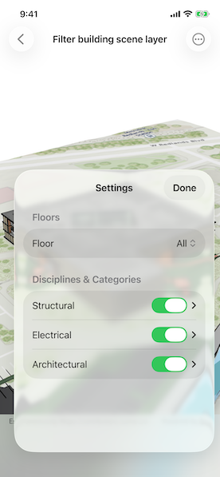

# Filter building scene layer

Explore details of a building scene by using filters and sublayer visibility.

## Use case

Buildings and their component parts (in this example, structural, electrical, or architectural) can be difficult to explain and visualize. An architectural firm might share a 3D building model visualization with clients and contractors to let them explore these components by floor and component type.

## How to use the sample

In the filter controls, select floor and category options to filter what parts of the Building Scene Layer are displayed in the scene. Tap on any of the building features to identify them.

## How it works

1. Create a `Scene` with the URL to a Building Scene Layer service.
2. Create a `LocalSceneView` with the scene.
3. Retrieve the `BuildingSceneLayer` from the scene's operational layers.
4. When a floor is selected, a `BuildingFilter` is created with two `BuildingFilterBlocks`. One highlights the selected floor, the second applies an x-ray view style to the floors below the selected floor.
5. Apply the filter to the `activeFilter` of the `BuildingSceneLayer` to view the changes to the model.
6. Select or deselect categories or sublayers to toggle the visibility of the features in those sublayers.
7. Tap on the building features to perform an identify operation on the `BuildingSceneLayer`. If a feature is identified, a popup with the feature's attribute will be displayed.

## Relevant API

* BuildingComponentSublayer
* BuildingFilter
* BuildingFilterBlock
* BuildingGroupSublayer
* BuildingSceneLayer
* LocalSceneView
* Scene

## About the data

This sample uses the [Esri Building E Local Scene](https://www.arcgis.com/home/item.html?id=b7c387d599a84a50aafaece5ca139d44) web scene, which contains a Building Scene Layer representing Building E on the Esri Campus in Redlands, CA. The Revit BIM model was brought into ArcGIS using the BIM capabilities in ArcGIS Pro and published to the web as a Building Scene Layer.

## Additional information

Buildings in a Building Scene Layer can be very complex models composed of sublayers containing internal and external features of the structure. Sublayers may include structural components like columns, architectural components like floors and windows, and electrical components.

Applying filters to the Building Scene Layer can highlight features of interest in the model. Filters are made up of filter blocks, which contain several properties that allow control over the filter's function. Setting the filter mode to X-Ray, for instance, will render features with a semi-transparent white color so other interior features can be seen. In addition, toggling the visibility of sublayers can show or hide all the features of a sublayer.

## Tags

3D, building scene layer, layers
