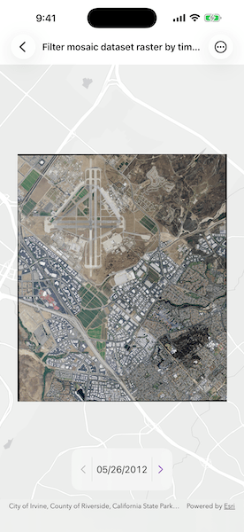

# Filter mosaic dataset raster by time extent

Visualize changes in rasters over time by filtering a mosaic dataset raster for a selected timestamp.

## Use case

A mosaic dataset can contain rasters collected over the same area at different times. Viewing the imagery one timestamp at a time makes it easier to compare how a place has changed, such as urban development, changes in vegetation, or the effects of a natural event.

## How to use the sample

When the sample starts, the mosaic dataset raster is displayed in a map view and the available acquisition timestamps are loaded. Use the previous and next controls to step through the distinct timestamps in chronological order. The currently selected timestamp is shown, and the map view updates to display imagery for that time.

## How it works

1. Create a `Map` and display it in a `MapView`.
2. Create and load a `MosaicDatasetRaster` from the sample mobile mosaic dataset and use it to create a raster layer.
3. Add the raster layer to the map.
4. Get the raster's `distinctTimestamps`.
5. Create a time extent with a time instant of the initial timestamp and set it on the map view.
6. Update the time extent on the map view when the selected timestamp changes.

## Relevant API

* Map
* MapView
* MosaicDatasetRaster
* RasterLayer
* TimeAware

## About the data

The sample uses a mobile mosaic dataset [ElToroMosaicDataset](https://www.arcgis.com/home/item.html?id=5d1c805850054a098667cdb217d76476) containing imagery rasters for one local area across multiple acquisition timestamps.

## Tags

aerial imagery, date, mosaic dataset, raster, time, time extent, time-aware, time-enabled, timestamp
