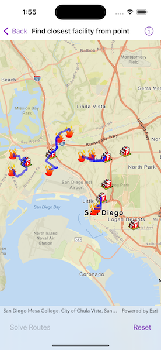

# Find closest facility from point

Find routes from several locations to the respective closest facility.

## Use case

Quickly and accurately determining the most efficient route between a location and a facility is a frequently encountered task. For example, a city's fire department may need to know which fire stations in the vicinity offer the quickest routes to multiple fires. Solving for the closest fire station to the fire's location using an impedance of "travel time" would provide this information.

## How to use the sample

Tap the "Solve Routes" button to solve and display the route from each incident (fire) to the nearest facility (fire station).

## How it works

1. Create a `ClosestFacilityTask` using a URL from an online service.
2. Get the default set of `ClosestFacilityParameters` from the task: `ClosestFacilityTask.makeDefaultParameters()`.
3. Create a `FeatureTable` using `ServiceFeatureTable.init(url:)`.
4. Add a list of all facilities to the task parameters: `ClosestFacilityParameters.setFacilities(fromFeaturesIn:queryParameters:)`.
5. Add a list of all incidents to the task parameters: `ClosestFacilityParameters.setIncidents(fromFeaturesIn:queryParameters:)`.
6. Get `ClosestFacilityResult` by solving the task with the provided parameters: `ClosestFacilityTask.solveClosestFacility(using:)`.
7. Find the closest facility for each incident by iterating over the list of `Incident`s.
8. Display the route as a `Graphic` using the `ClosestFacilityRoute.routeGeometry`.

## Relevant API

* ClosestFacilityParameters
* ClosestFacilityResult
* ClosestFacilityRoute
* ClosestFacilityTask
* Facility
* Graphic
* GraphicsOverlay
* Incident

## Tags

incident, network analysis, route, search
