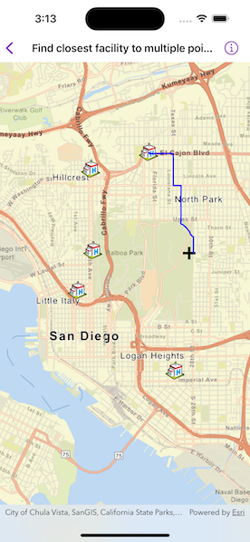

# Find closest facility to multiple points

Find a route to the closest facility from a location.

## Use case

Quickly and accurately determining the most efficient route between a location and a facility is a frequently encountered task. For example, a paramedic may need to know which hospital in the vicinity offers the possibility of getting an ambulance patient critical medical care in the shortest amount of time. Solving for the closest hospital to the ambulance's location using an impedance of "travel time" would provide this information.

## How to use the sample

Tap near any of the hospitals and a route will be displayed from that tapped location to the nearest hospital.

## How it works

1. Create a `ClosestFacilityTask` using a URL from an online network analysis service.
2. Get `ClosestFacilityParameters` from the task, `ClosestFacilityTask.makeDefaultParameters()`.
3. Add facilities to the parameters, `ClosestFacilityParameters.setFacilities(_:)`.
4. Add an incident to the parameters, `ClosestFacilityParameters.setIncidents(_:)`.
5. Get a `ClosestFacilityResult` by solving task with parameters, `ClosestFacilityTask.solveClosestFacility(using:)`.
6. Get the index list of closest facilities to the incident, `ClosestFacilityResult.rankedIndexesOfFacilities(forIncidentAtIndex:)`.
7. Get the index of closest facility.
8. Find the closest facility route, `ClosestFacilityResult.route(toFacilityAtIndex:fromIncidentAtIndex:)`.
9. Display the route on the `MapView` as a `Graphic` on a `GraphicsOverlay`.

## Relevant API

* ClosestFacilityParameters
* ClosestFacilityResult
* ClosestFacilityRoute
* ClosestFacilityTask
* Facility
* Graphic
* GraphicsOverlay
* Incident
* MapView

## Tags

incident, network analysis, route, search
