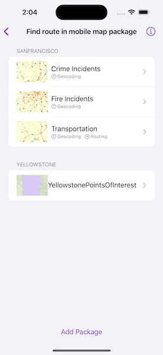
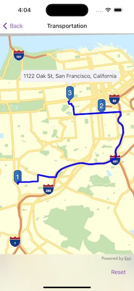

# Find route in mobile map package

Display maps and use locators to enable search and routing offline using a Mobile Map Package.

## Use case

Mobile map packages make it easy to transmit and store the necessary components for an offline map experience including: transportation networks (for routing/navigation), locators (address search, forward and reverse geocoding), and maps.

A field worker might download a mobile map package to support their operations while working offline.

## How to use the sample

A list of maps from a mobile map package will be displayed. If the map contains transportation networks, the list item will have a navigation icon. Tap on a map in the list to open it. If a locator task is available, tap on the map to reverse geocode the location's address. If transportation networks are available, a route will be calculated between geocode locations.

## How it works

1. Create a `MobileMapPackage` using `MobileMapPackage(fileURL:)`.
2. Get a list of maps inside the package using the `maps` property.
3. If the package has a locator, access it using the `locatorTask` property.
4. To see if a map contains transportation networks, check each map's `transportationNetworks` property.

## Relevant API

* GeocodeResult
* MobileMapPackage
* ReverseGeocodeParameters
* Route
* RouteParameters
* RouteResult
* RouteTask
* TransportationNetworkDataset

## Offline data

This sample uses the [San Francisco](https://www.arcgis.com/home/item.html?id=260eb6535c824209964cf281766ebe43) mobile map package and the [Yellowstone](https://www.arcgis.com/home/item.html?id=e1f3a7254cb845b09450f54937c16061) mobile map package. Both are downloaded from ArcGIS Online automatically.

## Tags

disconnected, field mobility, geocode, network, network analysis, offline, routing, search, transportation
