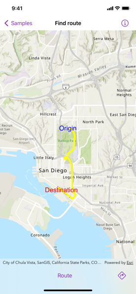
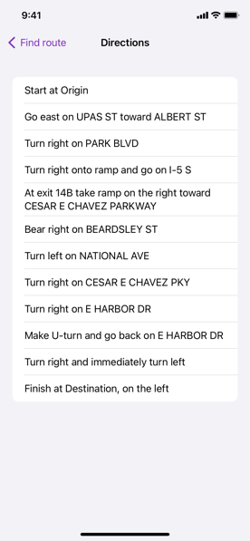

# Find route

Display directions for a route between two points.

## Use case

Find routes with driving directions between any number of locations. You might use the ArcGIS platform to create a custom network for routing on private roads.

## How to use the sample

For simplicity, the sample comes loaded with a start and end stop. You can click on the Find Route button to display a route between these stops. Once the route is generated, tap the directions icon for turn-by-turn directions shown in a list.

## How it works

1. Create a `RouteTask` instance using a URL to an online route service.
2. Create default `RouteParameters` using `RouteTask.createDefaultParameters()`.
3. Set `returnDirections` on the parameters to `true`.
4. Create `Stop` instances for each destination and assign the stops to the route parameters using `RouteParameters.setStops(_:)`.
5. Solve the route using `RouteTask.solveRoute(routeParameters:)` to get a `RouteResult`.
6. Create `GraphicsOverlay` and `Graphic` instances for the route and stops.
7. Iterate through the result's `Route`s. To display the route, update the route graphic's geometry with the route's `routeGeometry`. To display directions, get the direction maneuvers from the route's `directionManeuvers` property, and, for each maneuver, display the maneuver's `directionText`.

## Relevant API

* DirectionManeuver
* Route
* RouteParameters
* RouteParameters.setStops(_:)
* RouteResult
* RouteTask
* RouteTask.createDefaultParameters()
* RouteTask.solveRoute(routeParameters:)
* Stop

## Tags

directions, driving, navigation, network, network analysis, route, routing, shortest path, turn-by-turn
