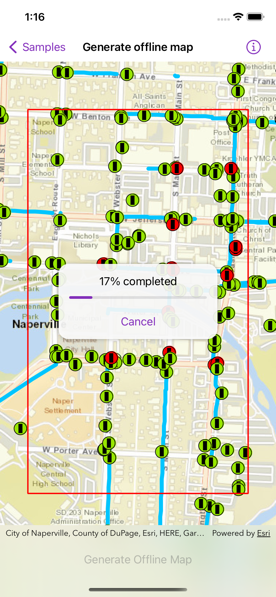

# Generate offline map

Take a web map offline.

## Use case

Taking a web map offline allows users continued productivity when their network connectivity is poor or nonexistent. For example, by taking a map offline, a field worker inspecting utility lines in remote areas could still access a feature's location and attribute information.

## How to use the sample

When the map loads, zoom to the extent you want to take offline. The red border shows the extent that will be downloaded. Tap the "Generate Offline Map" button to start the offline map job. The progress view will show the job's progress. When complete, the offline map will replace the online map in the map view.

## How it works

1. Create a `Map` instance with a `PortalItem`.
2. Create an `OfflineMapTask` instance with the online map.
3. Create `GenerateOfflineMapParameters` parameters for the offline map task with `OfflineMapTask.makeDefaultGenerateOfflineMapParameters(areaOfInterest:)`.
4. Create a `GenerateOfflineMapJob` with `OfflineMapTask.makeGenerateOfflineMapJob(parameters:downloadDirectory:)`, using the parameters and specifying a download directory URL.
5. Start the job and await its output.
6. Get the offline map from the output when the job successfully finishes.

## Relevant API

* GenerateOfflineMapJob
* GenerateOfflineMapParameters
* GenerateOfflineMapResult
* OfflineMapTask
* OfflineMapTask.makeDefaultGenerateOfflineMapParameters(areaOfInterest:)
* OfflineMapTask.makeGenerateOfflineMapJob(parameters:downloadDirectory:)
* PortalItem

## About the data

The map used in this sample shows the [Naperville water network](https://www.arcgis.com/home/item.html?id=acc027394bc84c2fb04d1ed317aac674) within Naperville, IL, USA, with cartography designed for web and mobile devices with offline support.

## Additional information

The creation of the offline map can be fine-tuned using "Generate offline map (overrides)" sample, or by using "Generate offline map with local basemap" sample to achieve more customized results.

## Tags

download, offline, save, web map
