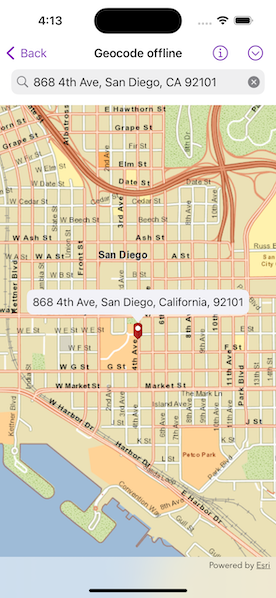

# Geocode offline

Geocode addresses to locations and reverse geocode locations to addresses offline.

## Use case

You can use an address locator file to geocode addresses and locations. For example, you could provide offline geocoding capabilities to field workers repairing critical infrastructure in a disaster when network availability is limited.

## How to use the sample

Type the address in the search bar or tap the arrow button in the toolbar and select from the list to geocode the address and view the result on the map. Tap a location to create a pin and reverse geocode. Tap, hold and pan to get real-time geocoding.

## How it works

1. Use the path of a .loc file to create a `LocatorTask` object.
2. Set up `GeocodeParameters` and call `LocatorTask.geocode(forSearchText:using:)` to get geocode results.

## Relevant API

* GeocodeParameters
* GeocodeResult
* LocatorTask
* ReverseGeocodeParameters

## Offline data

The sample viewer will download offline data automatically before loading the sample.

* [San Diego Streets Tile Package](https://www.arcgis.com/home/item.html?id=22c3083d4fa74e3e9b25adfc9f8c0496)
* [San Diego Offline Locator](https://www.arcgis.com/home/item.html?id=3424d442ebe54f3cbf34462382d3aebe)

## Tags

geocode, geocoder, locator, offline, package, query, search
