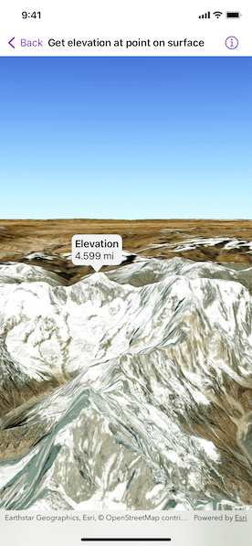

# Get elevation at point on surface

Get the elevation for a given point on a surface in a scene.

## Use case

Knowing the elevation at a given point in a landscape can aid in navigation, planning and survey in the field.

## How to use the sample

Tap anywhere on the surface to get the elevation at that point. Tap again to dismiss the callout. Elevation is reported in the standard local measurements. The scene view is in WGS84, which is a geographic coordinate system.

## How it works

1. Create a `SceneView` and a `Scene` with an `arcGISImagery` basemap.
2. Set the elevation source of the scene's base surface.
3. Convert the tapped screen point into a point on surface.
4. Asynchronously get the elevation using the `Surface.elevation(at:)` method and display the result.

## Relevant API

* ArcGISTiledElevationSource
* ElevationSource
* SceneView
* Surface

## Tags

elevation, point, surface
