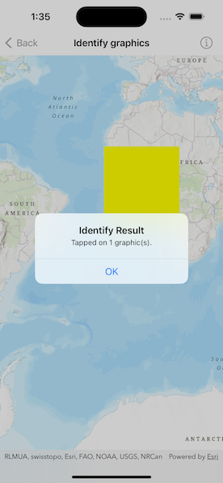

# Identify graphics

Display an alert message when a graphic is tapped.

## Use case

A user may wish to select a graphic on a map to view relevant information about it.

## How to use the sample

Tap on a graphic to identify it. You will see an alert message displayed.

## How it works

1. Create a `GraphicsOverlay` and add it to the `MapView`.
2. Add a `Graphic` along with a `SimpleFillSymbol` to the graphics overlay.
3. Use the `MapView.onSingleTapGesture(perform:)` to get the screen point where a user tapped.
4. Identify the graphic on the map view with `MapViewProxy.identify(on:screenPoint:tolerance:returnPopupsOnly:maximumResults:)`.

## Relevant API

* Graphic
* GraphicsOverlay
* IdentifyGraphicsOverlayResult
* MapView

## Tags

graphics, identify
