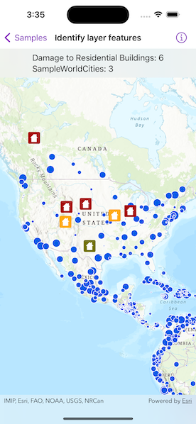

# Identify layer features

Identify features in all layers in a map.

## Use case

"Identify layers" operation allows users to tap on a map, returning features at that location across multiple layers. Because some layer types have sublayers, the sample recursively counts results for sublayers within each layer.

## How to use the sample

Tap to identify features. The text overlay will update to show all layers with features under the tapped location, as well as a layer count.

## How it works

1. The tapped position is passed to `MapViewProxy.identifyLayers(screenPoint:tolerance:returnPopupsOnly:maximumResultsPerLayer:)` method.
2. For each `IdentifyLayerResult` in the results, features are counted.
    * Note: there is one identify result per layer with matching features; if the feature count is 0, that means a sublayer contains the matching features.

## Relevant API

* IdentifyLayerResult
* LayerContent

## Additional information

The GeoView supports two methods of identify: `identifyLayer()`, which identifies features within a specific layer and `identifyLayers()`, which identifies features for all layers in the current view.

## Tags

identify, recursion, recursive, sublayers
