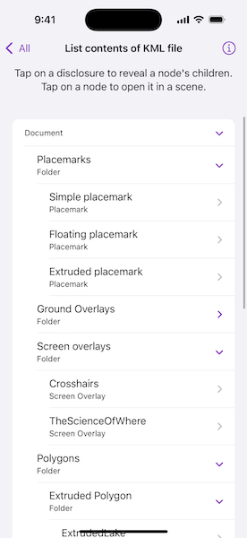

# List contents of KML file

List the contents of a KML file.

## Use case

KML files can contain a hierarchy of features, including network links to other KML content. A user may wish to traverse through the contents of KML nodes to know what data is contained within each node and, recursively, their children.

## How to use the sample

The contents of the KML file are shown in a tree. Tap on a disclosure to reveal a node's children. Tap on a node to open it in a scene zoomed to that node. Not all nodes can be zoomed to (e.g., screen overlays).

## How it works

1. Add the KML file to the scene as a layer.
2. Explore the root nodes of the `KMLDataset` recursively explored to create a view model.
    * Each node is enabled for display at this step. KML files may include nodes that are turned off by default.
3. When a node is selected, use the node's `extent` to create a `Viewpoint` and pass it to the `SceneView`.

## Relevant API

* KMLContainer
* KMLDataset
* KMLDocument
* KMLFolder
* KMLGroundOverlay
* KMLLayer
* KMLNetworkLink
* KMLNode
* KMLPlacemark
* KMLScreenOverlay

## Offline data

This sample uses the [esri_test_data](https://www.arcgis.com/home/item.html?id=da301cb122874d5497f8a8f6c81eb36e) KML file. It is downloaded from ArcGIS Online automatically.

## Tags

Keyhole, KML, KMZ, layers, OGC
