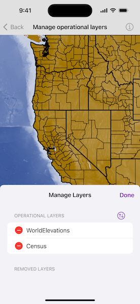
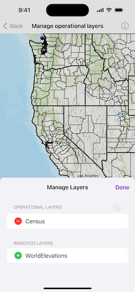

# Manage operational layers

Add, remove, and reorder operational layers in a map.

## Use case

Operational layers display the primary content of the map and usually provide dynamic content for the user to interact with (as opposed to basemap layers that provide context).

The order of operational layers in a map determines the visual hierarchy of layers in the view. You can bring attention to a specific layer by rendering above other layers.

## How to use the sample

Tap the "Manage Layers" button to display the operational layers that are currently on the map. In the first section, tap the "-" button to remove a layer, or tap "Edit" to drag and reorder the layers. The map will be updated automatically.

The second section shows layers that have been removed from the map. Tap the "+" button to add a layer back to the map.

## How it works

1. Get the operational layers from the map's `operationalLayers` property.
2. Add a layer using `map.addOperationalLayer(newOperationalLayer:)` or remove a layer using `map.removeOperationalLayer(operationalLayer:)`. The last layer in the array will be rendered on top.

## Relevant API

* ArcGISMapImageLayer
* Map

## Additional information

You cannot add the same layer to the map multiple times or add the same layer to multiple maps. Instead, clone the layer with `layer.clone()` to create a new instance.

## Tags

add, delete, layer, map, remove
