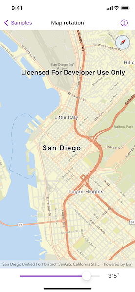

# Map rotation

Rotate a map.

## Use case

A user may wish to view the map in an orientation other than north-facing.

## How to use the sample

Use the slider to rotate the map. If the map is not pointed north, the compass will display the current heading. Click the compass to set the map's heading to north.

## How it works

1. Create a `Map` object with the `arcGISStreets` basemap style and add it to `MapView`.
2. Create an `Optional`-type `Viewpoint` object.
3. Create a `Compass` object using the toolkit.
4. Add the `Compass` to the map view as an overlay.

## Relevant API

* Compass
* MapView

## Tags

rotate, rotation, viewpoint
