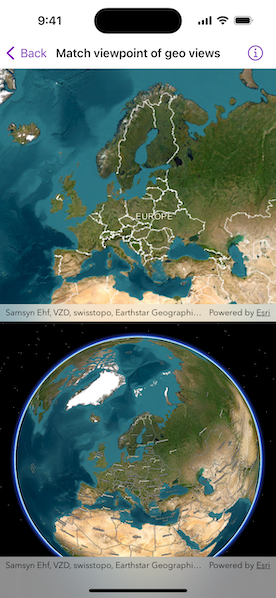

# Match viewpoint of geo views

Keep the viewpoints of two views, for example, a map view and a scene view, synchronized with each other.

## Use case

You might need to synchronize `GeoView` viewpoints if you had two map views in one application - a main map and an inset. An inset map view could display all the layers at their full extent and contain a hollow rectangular graphic that represents the visible extent of the main map view. As you zoom or pan in the main map view, the extent graphic in the inset map would adjust accordingly.

## How to use the sample

Interact with the map view or scene view by zooming or panning. The other map view or scene view will automatically focus on the same viewpoint.

## How it works

1. Use the `onNavigatingChanged(perform:)` modifier on each of the geo views to determine when they are navigating.
2. When a given geo view is navigating, use the `onViewpointChanged(kind:perform:)` modifier to set its new viewpoint on the other geo view's viewpoint.

## Relevant API

* GeoView
* MapView
* SceneView
* Viewpoint

## About the data

This application provides two different perspectives of the `arcGISImagery` basemap, A 2D `MapView` as well as a 3D `SceneView`, displayed on top of one another.

## Tags

3D, automatic refresh, event, event handler, events, extent, interaction, interactions, pan, zoom
