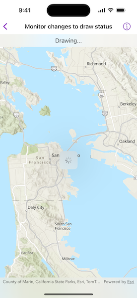

# Monitor changes to draw status

Get the draw status of your map view or scene view to know when all layers in the map or scene have finished drawing.

## Use case

You may want to display a loading indicator while layers are loading, which could then be removed when the draw status is `completed`.

## How to use the sample

Pan and zoom around the map. Observe the map's drawing status in the toolbar.

## How it works

1. Create a `MapView` with a `Map`.
2. Use the `onDrawStatusChanged(perform:)` modifier on the map view to get updates to the draw status.

## Relevant API

* DrawStatus
* Map
* MapView

## Tags

draw, loading, map, render
