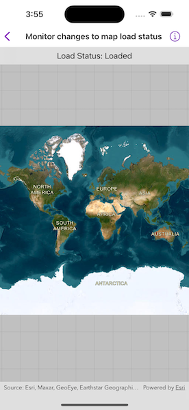

# Monitor changes to map load status

Determine the map's load status which can be: `notLoaded`, `failed`, `loading`, or `loaded`.

## Use case

Knowing the map's load state may be required before subsequent actions can be executed.

## How to use the sample

Open the sample to load the map. The load status will be displayed on screen.

## How it works

The `LoadStatus` is `loaded` when any of the following criteria are met:

* The map has a valid spatial reference.
* The map has an an initial viewpoint.
* One of the map's predefined layers has been created.

## Relevant API

* LoadStatus
* Map
* MapView

## Tags

load status, loadable pattern, map
