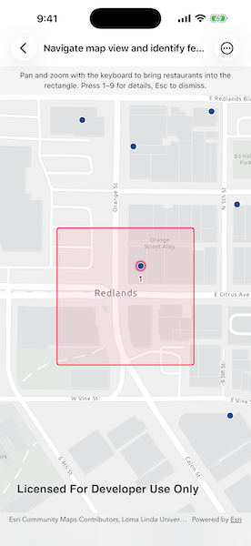

# Navigate map view and identify features with keyboard

Perform map navigation and identify nearby features using only the keyboard.

## Use case

Keyboard access is an important part of building inclusive GIS applications. Users who cannot or prefer not to use touch or pointer input need a way to move around the map, discover features, and read feature details from the keyboard.

## How to use the sample

Use keyboard navigation to pan and zoom until restaurants appear inside the rectangle. Restaurants inside the rectangle are selected and labeled in reading order, from top-to-bottom and left-to-right.

Press number keys `1` through `9` to show details for the matching restaurant. Press `Esc` to dismiss the callout and show the selection rectangle again.

If more than nine restaurants are inside the rectangle, zoom in or pan to narrow the results.

## How it works

1. Create a `Map` with an `arcGISLightGray` basemap centered on Redlands.
2. Create a `ServiceFeatureTable` from the Redlands restaurants feature service.
3. Create a `FeatureLayer` from the service feature table and apply a `SimpleRenderer` with a circular marker symbol.
4. Display the map and a `GraphicsOverlay` in a `MapView`.
5. Use `MapViewReader` to convert the four corners of the centered screen-space rectangle to map locations and create a map-space `Polygon`.
6. Query the restaurant feature table with `QueryParameters` using the polygon and an intersects spatial relationship.
7. Sort queried point features north-to-south, then west-to-east, so labels match reading order when the map is north-up.
8. Select the queried features on the `FeatureLayer`.
9. Add numbered `TextSymbol` graphics for the current group of features to the graphics overlay.
10. Add hidden SwiftUI `Button`s with `.keyboardShortcut` modifiers for number keys `1` through `9`. Each shortcut shows a `Callout` for the corresponding numbered feature, while the map view provides built-in `Esc` handling to dismiss the callout.

## Relevant API

* FeatureLayer
* Graphic
* GraphicsOverlay
* Map
* MapView
* Polygon

## About the data

This sample uses a [Redlands restaurants](https://www.arcgis.com/home/item.html?id=46119989eccd46a58b8f3d7aedadeb90) feature layer covering food establishments in Redlands, California. Each feature represents a single restaurant.

## Additional information

The map view supports built-in keyboard shortcuts such as arrow keys to pan and `+` and `-` to zoom. See [Navigate a map view](https://developers.arcgis.com/swift/maps-2d/navigate-a-map-view/) for the complete list of built-in interactions.

When Full Keyboard Access is enabled, the system may reserve the plain arrow keys for moving focus. In that mode, use `Shift` + arrow keys to pan the map while keeping the built-in `Alt`/`Option` + arrow shortcuts available for rotation and reset north.

## Tags

accessibility, accessible, identify, inclusive, keyboard, navigation, selection, WCAG
