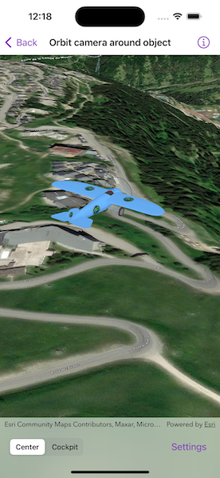

# Orbit camera around object

Fix the camera to point at and rotate around a target object.

## Use case

The orbit geoelement camera controller provides control over the following camera behaviors:

* Automatically track the target
* Stay near the target by setting a minimum and maximum distance offset
* Restrict where you can rotate around the target
* Automatically rotate the camera when the target's heading and pitch changes
* Disable user interactions for rotating the camera
* Animate camera movement over a specified duration
* Control the vertical positioning of the target on the screen
* Set a target offset (e.g., to orbit around the tail of the plane) instead of defaulting to orbiting the center of the object

## How to use the sample

The sample loads with the camera orbiting an airplane model. The camera is preset with a restricted camera heading, pitch, and a limited minimum and maximum camera distance set from the plane. The position of the plane on the screen is also set just below center.

Tap "Cockpit" to offset and fix the camera into the cockpit of the airplane. The camera will follow the pitch of the plane in this mode. In this view, adjusting the camera distance is disabled. Tap "Center" to exit the cockpit view and fix the camera controller on the center of the plane.

Use the "Camera Heading" slider to adjust the camera heading. Use the "Plane Pitch" slider to adjust the plane's pitch. When not in Cockpit view, the plane's pitch will change independently to that of the camera pitch.

Toggle on the "Allow Camera Distance Interaction" switch to allow zooming in and out by pinching. When the toggle is off, the user will be unable to adjust the camera distance.

## How it works

1. Instantiate an `OrbitGeoElementCameraController` with a `GeoElement` and camera distance as parameters.
2. Set the camera controller to the scene view.
3. Set the `cameraHeadingOffset`, `cameraPitchOffset`, and `cameraDistance` properties for the camera controller.
4. Set the minimum and maximum angle of heading and pitch, and minimum and maximum distance for the camera.
5. Set the distance from which the camera is offset from the plane using `setTargetOffsets(x:y:z:duration:)` or the properties.
6. Set the `targetVerticalScreenFactor` property to determine where the plane appears in the scene.
7. Animate the camera to the cockpit using `moveCamera(distanceDelta:headingDelta:pitchDelta:duration:)`.
8. Set `cameraDistanceIsInteractive` if the camera distance will adjust when zooming or panning using mouse or keyboard (default is true).
9. Set `autoPitchIsEnabled` if the camera will follow the pitch of the plane (default is true).

## Relevant API

* OrbitGeoElementCameraController

## Tags

3D, camera, object, orbit, rotate, scene
