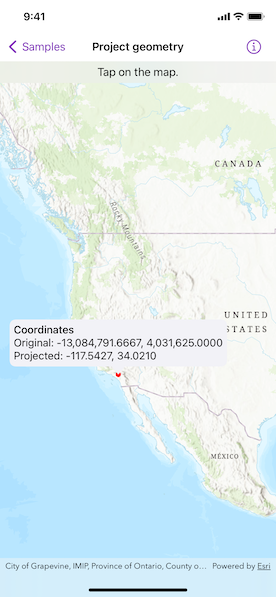

# Project geometry

Project a point to another spatial reference.

## Use case

Being able to project between spatial references is fundamental in GIS. An example of when you would need to re-project data is if you had data in two different spatial references, but wanted to perform an intersect analysis with the `static GeometryEngine.intersection(_:_:)` method. This method takes two geometries as parameters, and both geometries must be in the same spatial reference. If they are not, you could first use `static GeometryEngine.project(_:into:)` to convert the geometries so they match.

## How to use the sample

Tap anywhere on the map. A callout will display the tapped location's coordinate in the original basemap's spatial reference `webMercator` and in the projected spatial reference `wgs84`.

## How it works

1. Call the method, `static GeometryEngine.project(_:into:)`, passing in the original geometry and a spatial reference system to be projected to.

## Relevant API

* GeometryEngine
* Point
* SpatialReference
* static GeometryEngine.project(_:into:)

## Additional information

In cases where the output spatial reference uses a different geographic coordinate system than that of the input spatial reference, see the `static GeometryEngine.project(_:into:datumTransformation:)` method that additionally takes in a `DatumTransformation` parameter.

## Tags

coordinate system, coordinates, latitude, longitude, projected, projection, spatial reference, Web Mercator, WGS 84
