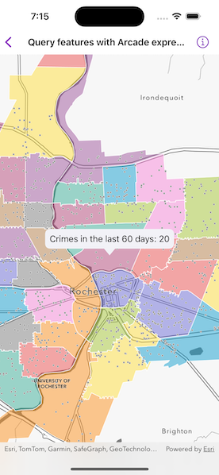

# Query features with Arcade expression

Query features on a map using an Arcade expression.



## Use case

Arcade is a portable, lightweight, and secure expression language used to create custom content in ArcGIS applications. Like other expression languages, it can perform mathematical calculations, manipulate text, and evaluate logical statements. It also supports multi-statement expressions, variables, and flow control statements. What makes Arcade particularly unique when compared to other expression and scripting languages is its inclusion of feature and geometry data types. This sample uses an Arcade expression to query the number of crimes in a neighborhood in the last 60 days.

## How to use the sample

Tap on any neighborhood to see the number of crimes in the last 60 days in a callout.

## How it works

1. Create a `PortalItem` using a portal and the ID.
2. Create a `Map` using the portal item.
3. Use the `onSingleTapGesture` modifier to listen for tap events on the map view.
4. Identify the visible layer where it is tapped on and get the feature.
5. Create the following `ArcadeExpression`:

    ```
    expressionValue = "var crimes = FeatureSetByName($map, 'Crime in the last 60 days');\n"
                      "return Count(Intersects($feature, crimes));"
    ```

6. Create an `ArcadeEvaluator` using the Arcade expression and `ArcadeProfile.formCalculation`.
7. Create a dictionary of profile variables with the following pairs:

    `["$feature": identifiedFeature]`

    `["$map": map]`

8. Call `evaluate(withProfileVariables:)` on the Arcade evaluator object and pass the profile variables to evaluate the Arcade expression.
9. Convert the result to a `Double` with `result(as:)` and populate the callout with the crime count.

## Relevant API

* ArcadeEvaluationResult
* ArcadeEvaluator
* ArcadeExpression
* ArcadeProfile
* Portal
* PortalItem

## About the data

This sample uses the [Crimes in Police Beats Sample](https://www.arcgis.com/home/item.html?id=539d93de54c7422f88f69bfac2aebf7d) ArcGIS Online Web Map which contains 2 layers for city beats borders and crimes in the last 60 days as recorded by the Rochester, NY police department.

## Additional information

Visit [Getting Started](https://developers.arcgis.com/arcade/) on the *ArcGIS Developer* website to learn more about Arcade expressions.

## Tags

Arcade evaluator, Arcade expression, identify layers, portal, portal item, query
