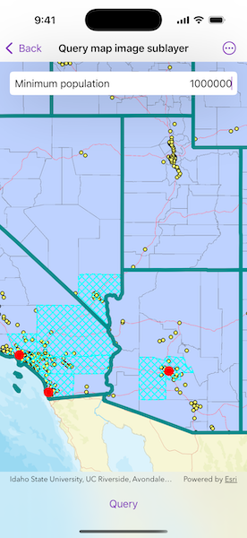

# Query map image sublayer

Find features in a sublayer based on attributes and location.

## Use case

Sublayers of an `ArcGISMapImageLayer` may expose a `ServiceFeatureTable` through a `table` property. This allows you to perform the same queries available when working with a table from a `FeatureLayer`: attribute query, spatial query, statistics query, query for related features, etc. An image layer with a sublayer of counties can be queried by population to only show those above a minimum population.

## How to use the sample

Specify a minimum population in the input field (values under 1810000 will produce a selection in all layers) and tap the "Query" button to query the sublayers in the current view extent. After a short time, the results for each sublayer will appear as graphics.

## How it works

1. Create an `ArcGISMapImageLayer` object using the URL of an image service.
2. After loading the layer, get the sublayer you want to query from the map image layer's `mapImageSublayers` array.
3. Load the sublayer, and then get its `ServiceFeatureTable` using `ArcGISMapImageSublayer.table`.
4. Create `QueryParameters` and define its `whereClause` and `geometry`.
5. Use `FeatureTable.queryFeatures(using:)` to get a `FeatureQueryResult` with features matching the query. The result is an enumerator of features.

## Relevant API

* ArcGISMapImageLayer
* ArcGISMapImageSublayer
* FeatureQueryResult
* QueryParameters
* ServiceFeatureTable

## About the data

The `ArcGISMapImageLayer` in the map uses the "USA" map service as its data source. This service is hosted by ArcGIS Online and is composed of four sublayers: "Cities", "Highways", "States", and "Counties".
Since the `cities`, `counties`, and `states` tables all have a `POP2000` field, they can all execute a query against that attribute and a map extent.

## Tags

query, search
