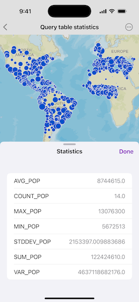

# Query table statistics

Query a table to get aggregated statistics back for a specific field.

## Use case

For example, a county boundaries table with population information can be queried to return aggregated results for total, average, maximum, and minimum population, rather than downloading the values for every county and calculating statistics manually.

## How to use the sample

Pan and zoom to define the extent for the query. Use the "Include Cities Outside Extent" toggle to control whether the query only includes features in the visible extent. Use the "Include Cities Under 5M" toggle to filter the results to only those cities with a population greater than 5 million people. Tap "Query Statistics" to perform the query and view the statistics. The query will return population-based statistics from the combined results of all features matching the query criteria.

## How it works

1. Create a `ServiceFeatureTable` with a URL to the feature service.
2. Create `StatisticsQueryParameters` using an array of `StatisticDefinition` objects. Depending on the state of the two toggles, additional parameters are set.
3. Query the feature table by passing the parameters to `queryStatistics(using:)`
4. Display each `StatisticRecord` in the returned `QueryStatisticsResult`.

## Relevant API

* ServiceFeatureTable
* StatisticDefinition
* StatisticRecord
* StatisticsQueryParameters
* StatisticsQueryResult
* StatisticType

## Tags

analysis, average, bounding geometry, filter, intersect, maximum, mean, minimum, query, spatial query, standard deviation, statistics, sum, variance
