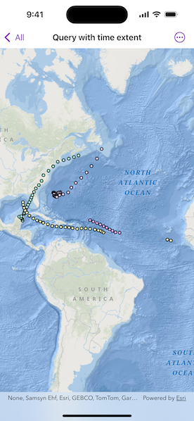

# Query with time extent

Query data using a time extent.

## Use case

This workflow can be used to return records that are between a specified start and end date. For example, records of Canada goose sightings over time could be queried to only show sightings during the winter migration time period.

## How to use the sample

Run the sample, and a subset of records will be displayed on the map.

## How it works

1. Create a `ServiceFeatureTable` from a URL of a time-enabled service. Time-enabled services will have TimeInfo defined in the service description. This information is specified in ArcMap or ArcGIS Pro prior to publishing the service.
2. Set the feature table's `featureRequestMode` property to `manualCache`, so that the developer can control how and when the feature table is populated with data.
3. Create an `FeatureLayer` with the feature table and add it to a map's operational layers to display it.
4. Create a `TimeExtent` object using `Date` objects for the start time and end time being queried.
5. Create a default `QueryParameters` object and set the parameter's `timeExtent` property.
6. Populate the feature table using `ServiceFeatureTable.populateFromService(using:clearCache:outFields:)` with the custom query parameters created in the previous steps.
7. The feature table is populated with data that matches the provided query.

## Relevant API

* QueryParameters
* ServiceFeatureTable.populateFromService(using:clearCache:outFields:)
* TimeExtent

## About the data

This sample uses Atlantic hurricane data from the year 2000. The data is from the National Hurricane Center (NOAA / National Weather Service).

## Tags

query, time, time extent
