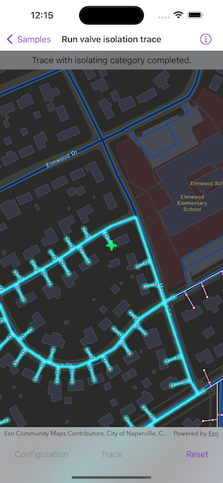
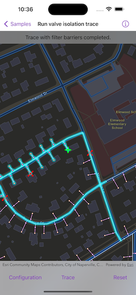

# Run valve isolation trace

Run a filtered trace to locate operable features that will isolate an area from the flow of network resources.

## Use case

Determine the set of operable features required to stop a network's resource, effectively isolating an area of the network. For example, you can choose to return only accessible and operable valves: ones that are not paved over or rusted shut.

## How to use the sample

Tap on one or more features to use as filter barriers or create and set the configuration's filter barriers by selecting a utility category. Toggle "Isolated Features" to update trace configuration. Tap "Trace" to run a subnetwork-based isolation trace. Tap "Reset" to clear filter barriers and trace results.

## How it works

1. Create a `MapView` instance.
2. Create and load a `ServiceGeodatabase` with a feature service URL and get tables with their layer IDs.
3. Create a `Map` object that contains `FeatureLayer`(s) created from the service geodatabase's tables.
4. Create and load a `UtilityNetwork` with the same feature service URL and map. Use the `onSingleTapGesture` modifier to listen for tap events on the map view.
5. Create `UtilityTraceParameters` with `isolation` trace type and a default starting location from a given asset type and global ID.
6. Get a default `UtilityTraceConfiguration` from a given tier in a domain network. Set its `filter` property with an `UtilityTraceFilter` object.
7. Add a `GraphicsOverlay` for showing starting location and filter barriers.
8. Populate the choice list for the filter barriers from the `categories` property of `UtilityNetworkDefinition`.
9. When the map view is tapped, identify which feature is at the tap location, and add a `Graphic` to represent a filter barrier.
10. Create a `UtilityElement` for the identified feature and add this element to the trace parameters' `filterBarriers` property.
    * If the element is a junction with more than one terminal, display a terminal picker. Then set the junction's `terminal` property with the selected terminal.
    * If it is an edge, set its `fractionAlongEdge` property using `GeometryEngine.polyline(_:fractionalLengthClosestTo:tolerance:)` method.
11. If "Trace" is tapped without filter barriers:
    * Create a new `UtilityCategoryComparison` with the selected category and `UtilityCategoryComparison.Operator.exists`.
    * Assign this condition to `UtilityTraceFilter.barriers` from the default configuration from step 6.
    * Update the configuration's `includesIsolatedFeatures` property.
    * Set this configuration to the parameters' `traceConfiguration` property.
    * Run `UtilityNetwork.trace(parameters:)` with the specified parameters.

    If "Trace" is tapped with filter barriers:
    * Update `includesIsolatedFeatures` property of the default configuration from step 6.
    * Run `UtilityNetwork.trace(parameters:)` with the specified parameters.
12. For every `FeatureLayer` in this map with trace result elements, select features by converting `UtilityElement`(s) to `ArcGISFeature`(s) using `UtilityNetwork.features(for:)`.

## Relevant API

* GeometryEngine.polyline(_:fractionalLengthClosestTo:tolerance:)
* ServiceGeodatabase
* UtilityCategory
* UtilityCategoryComparison
* UtilityCategoryComparison.Operator
* UtilityDomainNetwork
* UtilityElement
* UtilityElementTraceResult
* UtilityNetwork
* UtilityNetworkDefinition
* UtilityTerminal
* UtilityTier
* UtilityTraceFilter
* UtilityTraceParameters
* UtilityTraceParameters.TraceType
* UtilityTraceResult

## About the data

The [Naperville gas network feature service](https://sampleserver7.arcgisonline.com/server/rest/services/UtilityNetwork/NapervilleGas/FeatureServer), hosted on ArcGIS Online, contains a utility network used to run the isolation trace shown in this sample.

## Additional information

Using utility network on ArcGIS Enterprise 10.8 requires an ArcGIS Enterprise member account licensed with the [Utility Network user type extension](https://enterprise.arcgis.com/en/portal/latest/administer/windows/license-user-type-extensions.htm#ESRI_SECTION1_41D78AD9691B42E0A8C227C113C0C0BF). Please refer to the [utility network services documentation](https://enterprise.arcgis.com/en/server/latest/publish-services/windows/utility-network-services.htm).

## Tags

category comparison, condition barriers, filter barriers, isolated features, network analysis, subnetwork trace, trace configuration, trace filter, utility network
