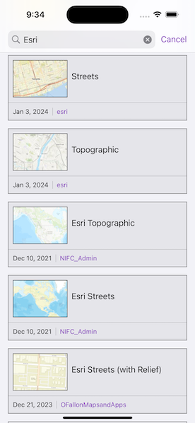

# Search for web map

Find web map portal items by using a search term.

## Use case

Portals can contain many portal items and, at times, you may wish to query the portal to find what you're looking for. In this example, we search for web map portal items using a text search.

## How to use the sample

Enter search terms into the search bar. Once the search is complete, a list is populated with the resultant web maps. Tap on a web map to set it to the map view. Scrolling to the bottom of the web map list view will get more results.

## How it works

1. Create a new `Portal` and load it.
2. Create new `PortalItemQueryParameters`. Set the type to web map by adding `type:"Web Map"` and add the text you want to search for. Note that web maps authored prior to July 2nd, 2014, are not supported. You can also limit the query to only return maps published after that date.
3. Use `findItems(queryParameters:)` to get the first set of matching items (10 by default).
4. Get more results using the `nextQueryParameters` from the `PortalQueryResultSet`.

## Relevant API

* Portal
* PortalItem
* PortalQueryParameters
* PortalQueryResultSet

## Tags

keyword, query, search, web map
