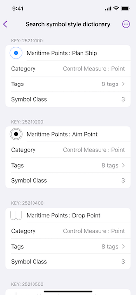

# Search symbol style dictionary

Find symbols within the mil2525d specification that match a keyword.

## Use case

You can use support for military symbology to allow users to report changes in the field using the correct military symbols.

## How to use the sample

The sample uses a pre-defined set of search parameters to search the symbol style. Results are shown in a list.

## How it works

1. Create a symbol dictionary with the mil2525d specification by passing the URL to a .stylx file to the `SymbolDictionary` initializer.
2. Create `SymbolStyleSearchParameters`.
3. Add members to the `names`, `tags`, `symbolClasses`, `categories`, and `keys` list fields of the search parameters.
4. Search for symbols using the parameters with `searchSymbols(using:)` method.
5. Get the `Symbol` from the list of returned `SymbolStyleSearchResult`s.

## Relevant API

* Symbol
* SymbolDictionary
* SymbolStyleSearchParameters
* SymbolStyleSearchResult

## Additional information

This sample features the mil2525D specification. ArcGIS Maps SDK supports other military symbology standards, including mil2525C and mil2525B(change 2). See the [Military Symbology Styles](https://solutions.arcgis.com/defense/help/military-symbology-styles/) overview on *ArcGIS Solutions for Defense* for more information about support for military symbology.

## Tags

CIM, defense, look up, MIL-STD-2525B, MIL-STD-2525C, MIL-STD-2525D, mil2525b, mil2525c, mil2525d, military, military symbology, search, symbology
