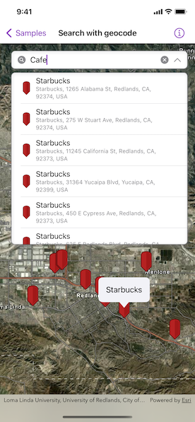

# Search with geocode

Find the location for an address, or places of interest near a location or within a specific area.

## Use case

A user can input a raw address into the app's search bar and zoom to the address location. When getting directions or looking for nearby places, users may only know what the place has ("food"), the type of place ("gym"), or the generic place name ("Starbucks"), rather than the specific address. You can get suggestions and locations for these places of interest (POIs) using a natural language query. Additionally, you can filter the results to a specific area.

## How to use the sample

Choose an address from the suggestions or submit your own address to show its location on the map in a callout. Tap on a result pin to display its address. If you pan away from the result area, a "Repeat Search Here" button will appear. Tap it to query again for the currently viewed area on the map.

## How it works

1. Create a `LocatorSearchSource` using the toolkit.
2. Create a `SearchView` using the toolkit with the locator search source.
3. Perform a search. Identify a result pin graphic in the graphics overlay and show a callout with its address.

## Relevant API

* ArcGISToolkit.LocatorSearchSource
* ArcGISToolkit.SearchView
* GeocodeParameters
* LocatorTask
* SearchResult
* SearchSuggestion
* SuggestParameters

## Additional information

This sample uses the World Geocoding Service. For more information, see [Geocoding service](https://developers.arcgis.com/documentation/mapping-apis-and-services/search/services/geocoding-service/) from ArcGIS Developer website.

## Tags

address, businesses, geocode, locations, locator, places of interest, POI, point of interest, search, suggestions, toolkit
