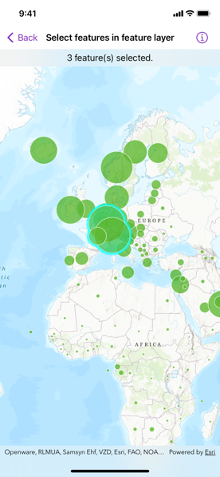

# Select features in feature layer

Select features in a feature layer.

## Use case

Selecting features, whether by query or identify, can be an important step both in editing data and in visualizing results. One possible use case would be to query a feature layer containing street furniture. A query might look for type "bench" and return a list of bench features contained in the features with an attribute of type bench. These might be selected for further editing or may just be highlighted visually.

## How to use the sample

Tap on a feature in the map. All features within a given tolerance (in points) of the tap will be selected.

## How it works

1. Create a `FeatureLayer` instance from a portal item (feature layer or feature service) and add it to the map's operational layers.
2. Create instances of `MapViewReader` and `MapView`.
3. Asynchronously identify nearby features at the tapped location from the map view using the `MapViewProxy.identify(layer:screenPoint:tolerance:maximumResults:)` method.
4. Select all identified features in the feature layer with `FeatureLayer.select(features:)`.

## Relevant API

* Feature
* FeatureLayer
* MapViewProxy
* MapViewReader

## About the data

This sample uses the [Gross Domestic Product Per Capita, 1960-2016](https://www.arcgis.com/home/item.html?id=10d76a5b015647279b165f3a64c2524f) feature service. Only the 2016 GDP values are shown.

## Tags

features, layers, select, selection, tolerance
