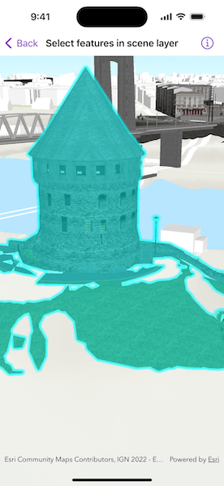

# Select features in scene layer

Identify features in a scene to select.

## Use case

You can select features to visually distinguish them with a selection color or highlighting. This can be useful to demonstrate the physical extent or associated attributes of a feature, or to initiate another action such as centering that feature in the scene view.

## How to use the sample

Tap on a building in the scene layer to select it. Deselect buildings by tapping away from the buildings.

## How it works

1. Create an instance of `ArcGISSceneLayer`, passing in the URL to a scene layer service.
2. Use the `onSingleTapGesture` on the `SceneView` to get the screen tapped location.
3. Use `SceneViewProxy.identify(layer:screenPoint:tolerance:maximumResults:)` to identify features in the scene.
4. From the resulting `IdentifyLayerResult`, get the list of identified `GeoElements`.
5. Get the first `Feature` in the list and use `ArcGISSceneLayer.selectFeature(features:)`.

## Relevant API

* ArcGISSceneLayer
* Scene
* SceneView
* SceneViewProxy
* SceneViewReader

## About the data

This sample shows a [Brest France Buildings Scene](https://www.arcgis.com/home/item.html?id=1c00d02465394b6ebaeffe8eb9739cd1) hosted on ArcGIS Online.

## Tags

3D, buildings, identify, model, query, search, select
