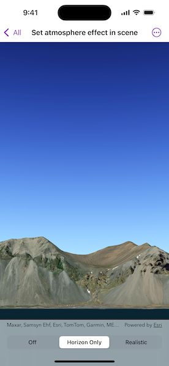

# Set atmosphere effect in scene

Changes the appearance of the atmosphere in a scene.

## Use case

Atmospheric effect can be used to make the scene view look more realistic.

## How to use the sample

Select one of the three available atmosphere effects. The sky will change to display the selected atmosphere effect.

## How it works

1. Create a `Scene` and add it to a `SceneView`.
2. Set the atmosphere effect on the scene view using the `SceneView.atmosphereEffect(_:)` modifier.

## Relevant API

* AtmosphereEffect
* Scene
* SceneView

## About the data

There are three atmosphere effect options:

* Realistic - A realistic atmosphere effect is applied over the entire surface.
* Horizon only - Atmosphere effect applied to the sky (horizon) only.
* Off - No atmosphere effect. The sky is rendered black with a starfield consisting of randomly placed white dots.

## Tags

atmosphere, horizon, sky
