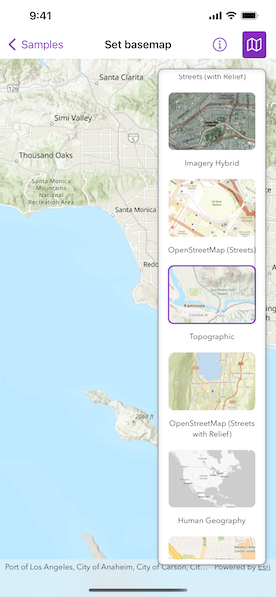

# Set basemap

Set a map's basemap.

## Use case

A basemap draws beneath all layers on a `Map` or `Scene` and is used to provide visual reference for the operational layers. Basemaps should be selected contextually. For example, in maritime applications, it would be more appropriate to use a basemap of the world's oceans as opposed to a basemap of the world's streets.

## How to use the sample

Tap the map button in the toolbar to view a list of the available basemaps. Tap an item to set it as the map's basemap.

## How it works

1. Create a `Map` object with the `arcGISImagery` basemap style.
2. Create a `MapView` instance with the map.
3. Create a `BasemapGallery` using the toolkit.

## Relevant API

* BasemapGallery
* BasemapStyle
* Map
* MapView

## Additional information

Organizational basemaps are a `Portal` feature allowing organizations to specify basemaps for use throughout the organization. Customers expect that they will have access to their organization's standard basemap set when they connect to a `Portal`. Organizational basemaps are useful when certain basemaps are particularly relevant to the organization, or if the organization wants to make premium basemap content available to their workers.

This samples uses the `BasemapGallery` toolkit component, which requires the [ArcGIS Maps SDK for Swift Toolkit](https://github.com/Esri/arcgis-maps-sdk-swift-toolkit). The `BasemapGallery` toolkit component supports selecting 2D and 3D basemaps from ArcGIS Online, a user-defined portal, or an array of Basemaps.

See [Customize basemaps](https://enterprise.arcgis.com/en/portal/latest/administer/windows/customize-basemaps.htm) in the Portal for ArcGIS documentation to learn about customizing the organization's basemap list in a portal.

## Tags

basemap, map
