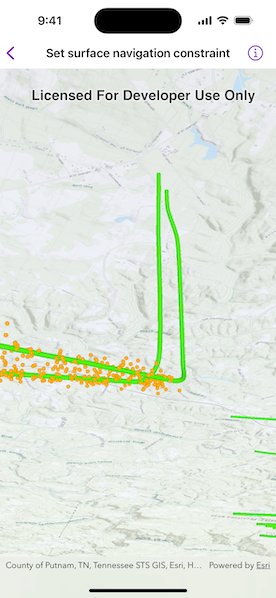

# Set surface navigation constraint

See through terrain in a scene and move the camera underground.

## Use case

By default, a scene's terrain is fully opaque, and the camera cannot go underground. To see underground features such as pipes in a utility network, you can lower the opacity of the terrain surface and set the navigation constraint on the surface to allow underground navigation.

## How to use the sample

The sample loads a scene with underground features. Pan and zoom to explore the scene. Observe how the opacity of the base surface is reduced and the navigation constraint is removed, allowing you to pan and zoom through the base surface.

## How it works

1. Display a `Scene` in a `SceneView`, which contains layers with underground features.
2. To see underground, get the scene's base surface and set its opacity to a value between 0 and 1.
3. To allow the camera to go underground, set the surface's navigation constraint to `unconstrained`.

## Relevant API

* Surface
* Surface.NavigationConstraint

## About the data

This sample shows an [Underground Wellbores and Seismic Events (Point Scene Layer) Webscene](https://www.arcgis.com/home/item.html?id=91a4fafd747a47c7bab7797066cb9272) hosted on ArcGIS Online. The data displays a point scene layer showing underground wellbore paths (green polylines) and seismic events (orange points).

## Tags

3D, subsurface, underground, utilities
