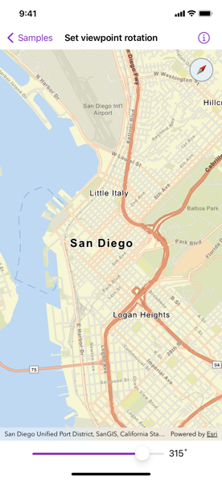

# Set viewpoint rotation

Rotate a map.

## Use case

A user may wish to view the map in an orientation other than north-facing.

## How to use the sample

Use the slider or pinch to rotate the map. If the map is not pointed north, the compass will display the current heading. Tap the compass to set the map's heading to north.

## How it works

1. Create a `Map` object with the `arcGISStreets` basemap style.
2. Create a `Viewpoint` object with a center, a scale, and a desired starting rotation.
3. Create a `MapView` instance with the map and viewpoint.
4. Update the viewpoint with a different rotation to change the rotation angle.

## Relevant API

* ArcGIS.MapView
* ArcGISToolkit.Compass

## Tags

rotate, rotation, toolkit, viewpoint
