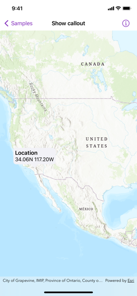

# Show callout

Show a callout with the latitude and longitude of user-tapped points.

## Use case

Callouts are used to display temporary detail content on a map. You can display text and arbitrary UI controls in callouts.

## How to use the sample

Tap anywhere on the map. A callout showing the WGS 84 coordinates in latitude and longitude for the tapped point will appear.

## How it works

1. Define an optional `LocationCalloutPlacement`.
2. Use the `onSingleTapGesture(perform:)` map view modifier to update the location callout placement.
3. Use the `callout(placement:content:)` map view modifier with the location callout placement to display a callout.

## Relevant API

* LocationCalloutPlacement
* MapView.callout(placement:content:)

## Tags

balloon, bubble, callout, flyout, flyover, info window, popup, tap
