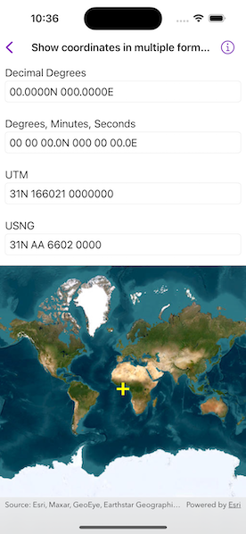

# Show coordinates in multiple formats

Format coordinates in a variety of common notations.

## Use case

The coordinate formatter can format a map location in WGS84 in a number of common coordinate notations. Parsing one of these formats to a location is also supported. Formats include decimal degrees; degrees, minutes, seconds; Universal Transverse Mercator (UTM), and United States National Grid (USNG).

## How to use the sample

Tap on the map to see the text fields update with the tapped location's coordinates formatted in 4 different ways. You can also put a coordinate string in the corresponding text field. Tap return and the coordinate string will be parsed to a map location which will move the map point and update the other text fields' coordinate strings.

## How it works

1. Get or create a map `Point` with a spatial reference.
2. To get the formatted string, use one of the static methods below.
    * `class CoordinateFormatter.latitudeLongitudeString(from:format:decimalPlaces:)`
    * `class CoordinateFormatter.utmString(from:conversionMode:addSpaces:)`
    * `class CoordinateFormatter.usngString(from:precision:addSpaces:)`
3. To get an `Point` from a formatted string, use one of the static methods below.
    * `class CoordinateFormatter.point(fromLatitudeLongitudeString:spatialReference:)`
    * `class CoordinateFormatter.point(fromUTMString:spatialReference:conversionMode:)`
    * `class CoordinateFormatter.point(fromUSNGString:spatialReference:)`

## Relevant API

* CoordinateFormatter
* CoordinateFormatter.LatitudeLongitudeFormat
* CoordinateFormatter.UTMConversionMode

## Tags

convert, coordinate, decimal degrees, degree minutes seconds, format, latitude, longitude, USNG, UTM
