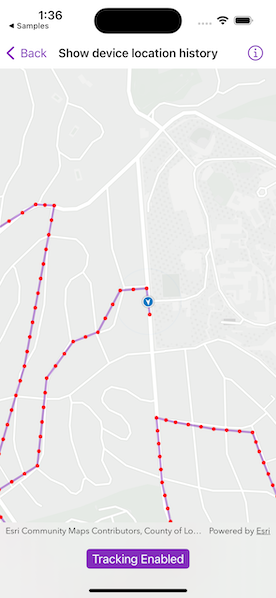

# Show device location history

Display your location history on the map.

## Use case

You can track device location history and display it as lines and points on the map. The history can be used to visualize how the user moved through the world, to retrace their steps, or to create new feature geometry. An unmapped trail, for example, could be added to the map using this technique.

## How to use the sample

Tap "Start Tracking" to start tracking your location, which will appear as points on the map. A line will connect the points for easier visualization. Tap "Stop Tracking" to stop updating the location history. This sample uses a simulated data source. To track a user's real position, use the default location data source instead.

## How it works

1. If necessary, request location permission from the operating system.
2. Create a graphics overlay to show each point and another graphics overlay for displaying the route line.
3. Create an instance of `SimulatedLocationDataSource` and initialize it with a polyline, and start receiving location updates.
    * To track a user's real position, use the default system location data source for location display instead.
4. Use the `for-await-in` syntax to get the location updates from `LocationDataSource.locations` asynchronous stream.
5. Every time the location updates, display a new point on the map, and recreate the route line.

## Relevant API

* Graphic
* GraphicsOverlay
* LocationDataSource
* LocationDisplay
* Map
* MapView
* PolylineBuilder
* SimpleLineSymbol
* SimpleMarkerSymbol
* SimpleRenderer
* SimulatedLocationDataSource

## About the data

The default system location data source relies on [Core Location](https://developer.apple.com/documentation/corelocation), which works with device sensors.

A custom set of points is used to create a `Polyline` and initialize a `SimulatedLocationDataSource`. This simulated location data source enables easier testing and allows the sample to be used on devices without an actively updating GPS signal.

## Tags

bread crumb, breadcrumb, GPS, history, movement, navigation, real-time, trace, track, trail
