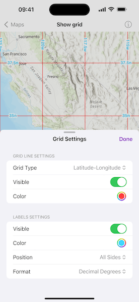

# Show grid

Display and customize coordinate system grids, including Latitude/Longitude, MGRS, UTM, and USNG, on a map view or scene view.

## Use case

Grids are often used on printed maps, but can also be helpful on digital 2D maps or 3D scenes, to identify locations.

## How to use the sample

Use the picker to change the view from 2D or 3D, or tap the button in the toolbar to open the grid settings. You can select the type of grid (LatLong, MGRS, UTM, and USNG) and modify its properties like the visibility and color of the lines, and the position, format, and units of the labels.

## How it works

1. Create an instance of one of the `Grid` types.
2. Grid lines and labels can be styled per grid level with `grid.lineSymbols[0]` and `grid.textSymbols[0]` subscripts on the grid.
3. The label position, format, unit, and visibility can be specified with `labelPosition`, `labelFormat`, `labelUnit`, and `isVisible` on the `Grid`.
    * Note that as of 200.6, MGRS, UTM, and USNG grids in a SceneView only support the `geographic` label position.
4. For the `LatitudeLongitudeGrid` type, you can specify a label format of `decimalDegrees` or `degreesMinutesSeconds`.
5. To set the grid, assign it to the map view or scene view using the `grid(_:)` modifier.

## Relevant API

* Grid
* LatitudeLongitudeGrid
* MapView
* MGRSGrid
* SceneView
* SimpleLineSymbol
* TextSymbol
* USNGGrid
* UTMGrid

## Tags

coordinates, degrees, graticule, grid, latitude, longitude, MGRS, minutes, seconds, USNG, UTM
