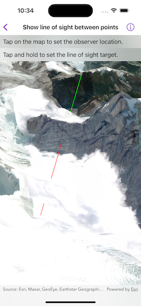

# Show line of sight between points

Perform a line of sight analysis between two points in real time.

## Use case

A line of sight analysis can be used to assess whether a view is obstructed between an observer and a target. Obstructing features could either be natural, like topography, or man-made, like buildings. Consider an events planning company wanting to commemorate a national event by lighting sequential beacons across hill summits or roof tops. To guarantee a successful event, ensuring an unobstructed line of sight between neighboring beacons would allow each beacon to be activated as intended.

## How to use the sample

Tap on the map to set the observer location. Tap and hold to set the line of sight target. A red segment on the line means the view between observer and target is obstructed, whereas green means the view is unobstructed.

## How it works

1. Create an `AnalysisOverlay` and add it to the scene view.
2. Create a `LocationLineOfSight` with initial observer and target locations and add it to the analysis overlay.
3. Track the screen taps using the `onSingleTapGesture` and `onLongPressGesture`.
4. Use the scene point to update the target location with `lineOfSight.targetLocation` and the observer location with `lineOfSight.observerLocation`.

## Relevant API

* AnalysisOverlay
* LocationLineOfSight
* SceneView

## Tags

3D, line of sight, visibility, visibility analysis
