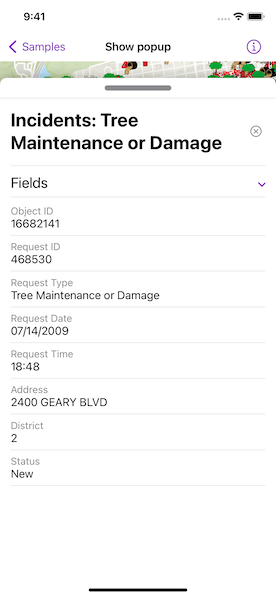

# Show popup

Show a predefined popup from a web map.

## Use case

Many web maps contain predefined popups which are used to display the attributes associated with each feature layer in the map, such as hiking trails, land values, or unemployment rates. You can display text, attachments, images, charts, and web links. Rather than creating new popups to display information, you can easily access and display the predefined popups.

## How to use the sample

Tap on the features to prompt a popup that displays information about the feature.

## How it works

1. Create and load a `Map` instance from a `PortalItem` of a web map.
2. Create a `MapView` with the `Map`.
3. Use the `GeoViewProxy.identifyLayers(_:screenPoint:tolerance:returnPopupsOnly:maximumResultsPerLayer:)` method to identify the top-most feature.
4. Create a `PopupView` with the result's first popup.

## Relevant API

* IdentifyLayerResult
* Map
* PopupView

## About the data

This sample uses a [web map](https://www.arcgis.com/home/item.html?id=fb788308ea2e4d8682b9c05ef641f273) that displays reported incidents in San Francisco.

## Tags

feature, feature layer, popup, web map
