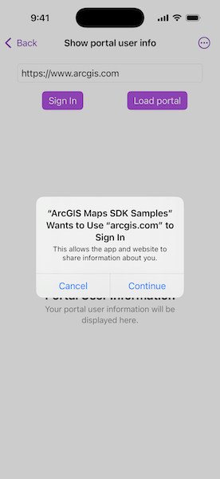

# Show portal user info

Retrieve a user's details via a Portal.

## Use case

This portal information can be used to provide a customized UI experience for the user. For example, you can show a thumbnail of the user in the application to indicate that they are currently logged in.

## How to use the sample

Enter your ArcGIS Online credentials for the specified URL.

## How it works

1. Present the user with an editable text field for enterting a portal URL.
2. Create and load a portal with the URL.
3. If the portal is secured, it may potentially issue an authentication challenge.
4. Display the desired portal info once loading has successfully completed. Otherwise, if loading failed, display the error.
5. Upon successful login, get a `PortalUser` using `portal.user`. Get user attributes using:
   * `portalUser.portalName`
   * `portalUser.username`
   * `portalUser.email`
   * `portalUser.creationDate`
   * `portalUser.thumbnail.image`
6. The "Sign out" button clears any saved credentials.

## Relevant API

* OAuthUserConfiguration
* Portal
* PortalInfo
* PortalUser

## About the data

This sample signs into your ArcGIS online account and displays the user's profile information.

## Tags

account, avatar, bio, cloud and portal, email, login, picture, profile, user, username
