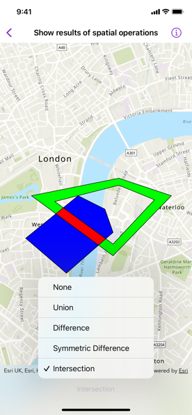

# Show result of spatial operations

Find the union, intersection, or difference of two geometries.

## Use case

The different spatial operations (union, difference, symmetric difference, and intersection) can be used for a variety of spatial analyses. For example, government authorities may use the intersect operation to determine whether a proposed road cuts through a restricted piece of land such as a nature reserve or a private property.

When these operations are chained together, they become even more powerful. An analysis of food deserts within an urban area might begin by union-ing service areas of grocery stores, farmers markets, and food co-ops. Taking the difference between this single geometry of all services areas and that of a polygon delineating a neighborhood would reveal the areas within that neighborhood where access to healthy, whole foods may not exist.

## How to use the sample

The sample provides an option to select a spatial operation. When an operation is selected, the resulting geometry is shown in red.

## How it works

1. Create a `GraphicsOverlay` object.
2. Create `Graphic` instances for the overlapping polygons and result.
3. Add the overlapping polygons and result graphics to the graphics overlay.
4. Perform spatial relationships between the polygons by using the appropriate operation:
    * `static GeometryEngine.union(_:_:)` - This method returns the two geometries united together as one geometry.
    * `static GeometryEngine.difference(_:_:)` - This method returns the difference between two geometries.
    * `static GeometryEngine.symmetricDifference(_:_:)` - This method returns any part of two geometries that do not intersect.
    * `static GeometryEngine.intersection(_:_:)` - This method returns the intersection of two geometries.
5. Use the geometry that is returned from the method call to update the geometry of the results graphic.

## Relevant API

* Geometry
* GeometryEngine
* Graphic
* GraphicsOverlay
* static GeometryEngine.difference(_:_:)
* static GeometryEngine.intersection(_:_:)
* static GeometryEngine.symmetricDifference(_:_:)
* static GeometryEngine.union(_:_:)

## Tags

analysis, combine, difference, geometry, intersection, merge, polygon, union
