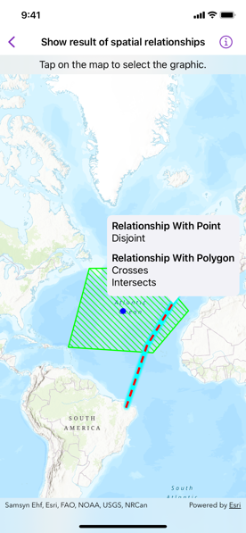

# Show result of spatial relationships

Determine spatial relationships between two geometries.

## Use case

In case of a natural disaster, emergency services can represent the affected areas using polygons. By determining the spatial relationships between these and any other existing features such as populated areas, infrastructure, or natural resources, it is possible to quickly determine which of the existing features might be affected or is in further danger, helping to assess risk and define further action.

## How to use the sample

Tap on the map to select one of the three graphics. Its geometry will be used to check the spatial relationships with the other graphics' geometries. The result will be displayed in a callout.

## How it works

1. Get the geometry from two different graphics. In this example, the geometry of the selected graphic is compared to the geometry of each unselected graphic.
2. Use the methods in `GeometryEngine` - `isGeometry(_:crossing:)`, `doesGeometry(_:contain:)`, `isGeometry(_:disjointWith:)`, `isGeometry(_:intersecting:)`, `isGeometry(_:overlapping:)`, `isGeometry(_:touching:)`, and `isGeometry(_:within:)`, to check the relationship between the geometries, e.g. *contains*, *disjoint*, *intersects*, etc. The relationship exists if the method returns `true`.

## Relevant API

* Geometry
* GeometryEngine
* Graphic
* Point
* Polygon
* Polyline
* static GeometryEngine.doesGeometry(_:contain:)
* static GeometryEngine.isGeometry(_:crossing:)
* static GeometryEngine.isGeometry(_:disjointWith:)
* static GeometryEngine.isGeometry(_:intersecting:)
* static GeometryEngine.isGeometry(_:overlapping:)
* static GeometryEngine.isGeometry(_:touching:)
* static GeometryEngine.isGeometry(_:within:)

## Tags

geometries, relationship, spatial analysis
