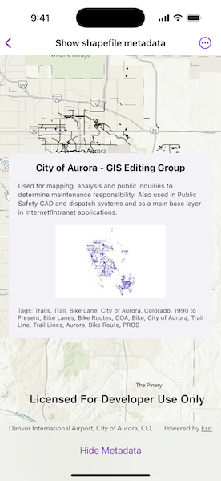

# Show shapefile metadata

Read a shapefile and display its metadata.

## Use case

You can display information about the shapefile your user is viewing, like tags, credits, and summary.

## How to use the sample

The shapefile's metadata will be displayed when you open the sample.

## How it works

1. Load the assets url in the `ShapefileFeatureTable`.
2. Get the `ShapefileInfo` from the feature table's `info` property.
3. Get the image from `fileInfo.thumbnail` and display it.
4. Display the `summary`, `credits`, and `tags` properties from the shapefile info.

## Relevant API

* ShapefileFeatureTable
* ShapefileFeatureTable.info
* ShapefileInfo
* ShapefileInfo.credits
* ShapefileInfo.summary
* ShapefileInfo.tags
* ShapefileInfo.thumbnail

## Offline data

[Aurora Colorado Shapefiles](https://www.arcgis.com/home/item.html?id=d98b3e5293834c5f852f13c569930caa) is available as an item hosted on ArcGIS Online].

## About the data

This sample uses a shapefile showing bike trails in Aurora, CO. The [Aurora Colorado Shapefiles](https://www.arcgis.com/home/item.html?id=d98b3e5293834c5f852f13c569930caa) are available as an item on ArcGIS Online.

## Tags

credits, description, metadata, package, shape file, shapefile, summary, symbology, tags, visualization
